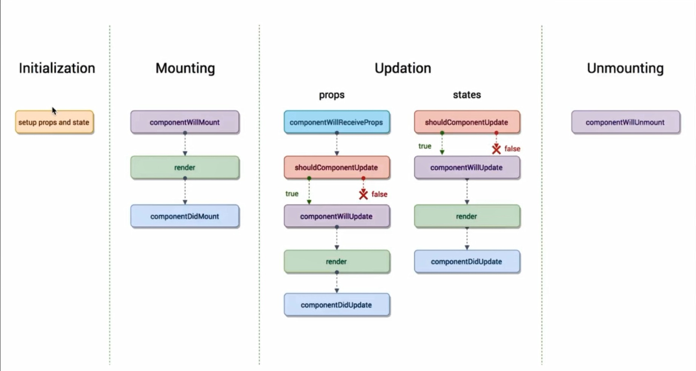
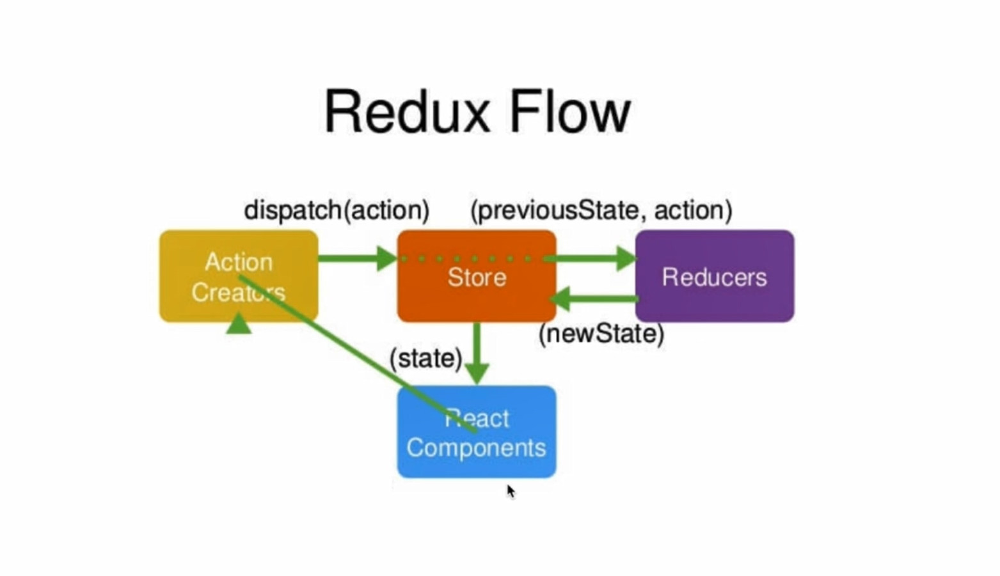
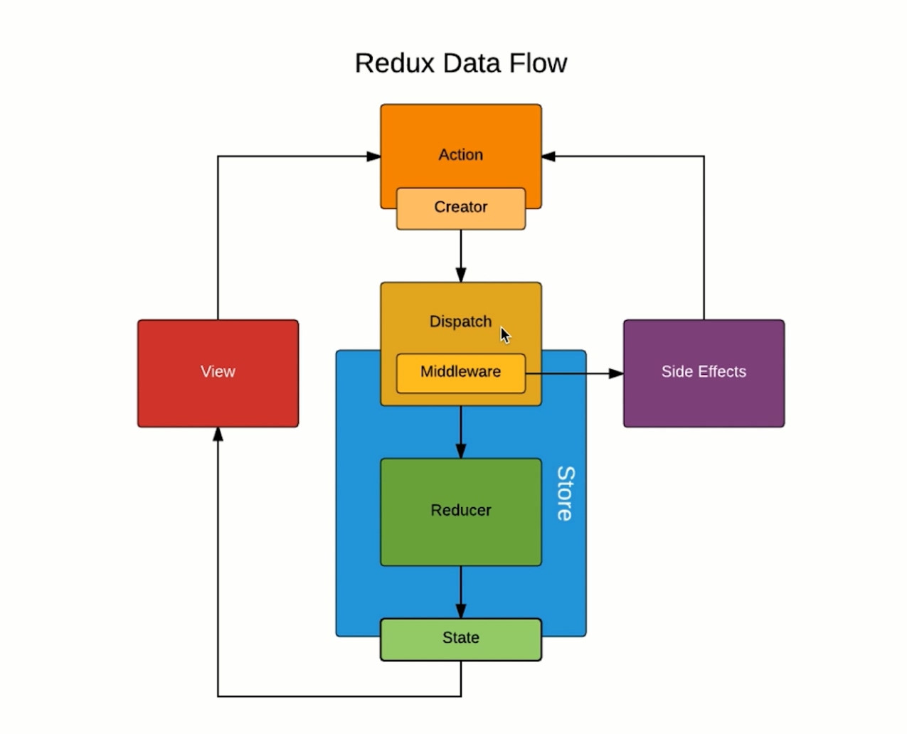

# react视频学习笔记

> 之前看完了react官网的教程，写了一个react版本的todo。之后想写一个react版本的poem网站，主要是为了熟悉react和使用react-router。但在查了一圈资料后发现有点难以下手，所以就找了这么一套视频（React16.4 开发简书项目 从零基础入门到实战）全面学习一下。

## 学习内容

1. creat-react-app

2. 组件化思维

3. JSX

4. 开发调试工具

5. 虚拟DOM

6. 生命周期

7. React-transition-group

8. Redux

9. Antd

10. UI, 容器组件

11. 无状态组件

12. redux-thunk

13. redux-saga

14. Styled-components

15. Immutable.js

16. redux-immutable

17. axios

18. react-router

## 2. React 特点

1. 声明式开发

2. 可以与其他框架并存

3. 组件化

4. 单项数据流

5. 视图层框架

6. 函数式编程

## JSX语法

1. JSX中自定义标签（组件）需要采用“大骆驼拼写法”。

2. 不想显示外层包裹元素可以使用Fragment代替。

3. 事件名要用“小骆驼拼写法”。

4. 注释：
```
<div>
	{/*注释*/}
</div>
// 或者
<div>
	{
		// 注释
	}
</div>
```

5. 不对标签进行转译：dangerouslySetInnerHTML={{__html: content}}

6. 属性映射
|html|jsx|
|--|--|
|class|className|
|for|htmlFor|

## 数据

1. 要改变state里的数据需要调用this.setState方法。

## 作用域

1. 组件内部的方法需要绑定组件作用域。

## setState

1. setState 可以采用对象写法，但现在不推荐了
```
this.setState({
	item: content
})
```

2. setState 可以采用函数式写法，目前推荐写法
```
this.setState(() => ({ item: content }))
```

3. setState 采用函数式写法可以提高性能，但是是异步的，如果是获取事件对象的值，要如下处理
```
handleInputChange(e) {
  const value = e.target.value
  this.setState(() => ({ inputValue: value }))
}
```

## props

### propTypes

1. 使用：
```
import PropTypes from 'prop-types'
……
Component.propTypes = {
	a: PropTypes.string.isRequired,
	a: PropTypes.func
}
```

2. 多种检测类型：string、func、string……

3. 是否必须：isRequired

### defaultProps

1. 为 props 提供默认值
```
Component.defaultProps = {
	a: 'hello world'
}
```

## ref

1. React16 推荐的 ref 参数是一个函数。这个函数的默认参数是 ref 绑定的元素。

2. 并不推荐使用 ref。在面向数据编程的思想中，尽量不要直接操作 DOM。

3. 在 setState 操作后获取元素的操作会与预期不一样。因为 setState 是异步操作，获取元素时 setState 未完成。解决方法是：setState 的第二个参数是一个回调函数，在这个回调函数里操作 DOM。

## 虚拟DOM

1. 原理：通过 js 对象模拟真实 DOM，当数据发生变化，再生成新的虚拟 DOM，对比旧的虚拟 DOM 和新的虚拟 DOM，收集两者的差异，更新真实的 DOM。因为 js 比 DOM 快很多，所以虚拟 DOM 可以极大地提升性能。

2. react diff 算法采用的是同层对比。如果同层发生变化，则子级全部替换。这会消耗性能，但这种 diff 算法简单，节省了 diff 的性能消耗。

## 声明周期

1. 定义：生命周期函数指在某一个时期组件会自动调用执行的函数。



2. componentWillMount: 在组件即将被挂载到页面的时刻自动执行。

3. componentDidMount: 组件被挂载到页面后自动执行。

4. componentWillReceiveProps: 当一个组件从父组件接受了参数，当父组件 render 函数被重新执行，子组件的这个生命周期函数就会被执行。即子组件第一次存在于父组件中不会执行，只有之前已经存在于父组件中才会执行。这个组件会接受两个参数：nextProps、nextState。

5. shouldComponentUpdate: 组件被更新之前自动执行。这个声明周期函数需要返回一个布尔值，表明是否需要更新组件。

6. componentWillUpdate: 组件被更新之前自动执行。

7. componentDidUpdate: 组件更新完成后自动执行。

8. componentWillUnmount: 当组件即将被从页面中卸载时自动执行。

## css动画

1. animation 保留最后一帧的状态需要传递第四个参数为 forwards
```
.hide {
  animation: hide-item 1s ease-in forwards;
}

@keyframes hide-item {
  0% {
    opacity: 1;
    color: red;
  }
  50% {
    opacity: 0.5;
    color: green;
  }
  100% {
    opacity: 0;
    color: blue;
  }
}
```

2. react-transition-group 包可以提供动画的简便实现。

## Redux

1. Redux = Reducer + Flux



2. reducer 可以接受 state, 但是绝不能修改 state

3. 要将 store 里数据的变化应用到组件，需要订阅。并且，处理函数要在订阅之前绑定作用域，否则会报错。
```
class TodoList extends Component {

  constructor(props) {
    super(props)
    this.state = store.getState()

    this.handleStoreChange = this.handleStoreChange.bind(this)
    store.subscribe(this.handleStoreChange)
  }

  handleStoreChange() {
    this.setState(store.getState())
  }

  ……

```

4. action 的 type 可以统一管理——例如写入一个 actionTypes.js 的文件，避免拼写不一致出错以及方便错误排查。

5. 对于 action 也可以统一管理，将所有 action 写入一个文件。

6. 注意项目：

  - store 是唯一的：项目中只有一个 store

  - 只有 store 能改变自己的内容

  - Reducer 必须是一个纯函数

7. api

  - createStore

  - store.dispatch

  - store.getStore

  - store.subscribe

### redux中间件



1. redux 中间件是对 dispatch 的封装。

### redux-thunk

1. 使用了 redux-thunk 插件后，action 就可以返回函数，而不仅仅是对象。

### redux-saga

1. git 地址：https://github.com/redux-saga/redux-saga

## 组件

1. 可以将应用内的组件分为 “UI 组件”和“容器组件”

2. UI 组件--负责页面的渲染

3. 容器组件--处理逻辑

4. 无状态组件--纯函数组件。如果一个组件只有 render 方法，可以将其改为一个无状态组件。相比于普通组件（类），无状态组件（函数）的性能更好。UI 组件写成无状态组件更为合适。

## React-redux

1. react-redux 提供了 `<Provider>` 组件。在这个组件上传递的数据，子组件都可以使用。

2. connect 将 store 将组件连接。

## styled-components

> 安装的 styled-components 是 v4.2.0 的，与视频的不一样，所以写法也不一样。

1. 没有 injectGlobal 这个 API 了，取而代之的是 createGlobalStyle。这个 API 是用来创建一个组件的。
```
// 创建css组件
export const Global = createGlobalStyle`
  html, body, div, span, applet, object, iframe,
	h1, h2, h3, h4, h5, h6, p, blockquote, pre,
	a, abbr, acronym, address, big, cite, code,
	del, dfn, em, img, ins, kbd, q, s, samp,
	small, strike, strong, sub, sup, tt, var,
	b, u, i, center,
	dl, dt, dd, ol, ul, li,
	fieldset, form, label, legend,
	table, caption, tbody, tfoot, thead, tr, th, td,
	article, aside, canvas, details, embed, 
	figure, figcaption, footer, header, hgroup, 
	menu, nav, output, ruby, section, summary,
	time, mark, audio, video {
		margin: 0;
		padding: 0;
		border: 0;
		font-size: 100%;
		font: inherit;
		vertical-align: baseline;
	}
	/* HTML5 display-role reset for older browsers */
	article, aside, details, figcaption, figure, 
	footer, header, hgroup, menu, nav, section {
		display: block;
	}
	body {
		line-height: 1;
	}
	ol, ul {
		list-style: none;
	}
	blockquote, q {
		quotes: none;
	}
	blockquote:before, blockquote:after,
	q:before, q:after {
		content: '';
		content: none;
	}
	table {
		border-collapse: collapse;
		border-spacing: 0;
	}
`

// 使用css组件
import React, { Fragment } from 'react'

import { Global } from './style.js'

function App() {
  return (
    <Fragment>
      <Global />
      <div>
        dd
      </div>
    </Fragment>
  );
}

export default App;
```

## react-router

1. 安装包为 react-router-dom
```
npm i react-router-dom -s
import { BrowserRouter, Route } from 'react-router-dom'
```

2. 路径的严格匹配需要添加 exact 属性

3. Link 组件必须写在 BrowserRouter 组件里面。比如可以在父组件用 BrowserRouter 包裹子组件，这样子组件就可以使用 Link 了。

## immutable.js

1. 用来确保数据不被改变。

2. immutable 处理过的数据不能通过属性运算符取值，需要通过 get 方法得到值。
```
import { fromJS } from 'immutable'
const im = fromJS({
  p: 1
})

// 错误
console.log(im.p)

// 正确
console.log(im.get('p'))

```

3. immutable 处理过的数据的修改需要通过 set 方法实现。

4. List 只能把外层数组变成 immutable，而 fromJS 可以将整个全部变成 immutable。

## 吐槽

1. 数据的双向绑定竟然要自己监听事件来实现。

2. redux 竟然要自己手动订阅。

3. redux、redux-thunk、redux-saga、react-redux…… 还能更蛋疼一点吗-_-


